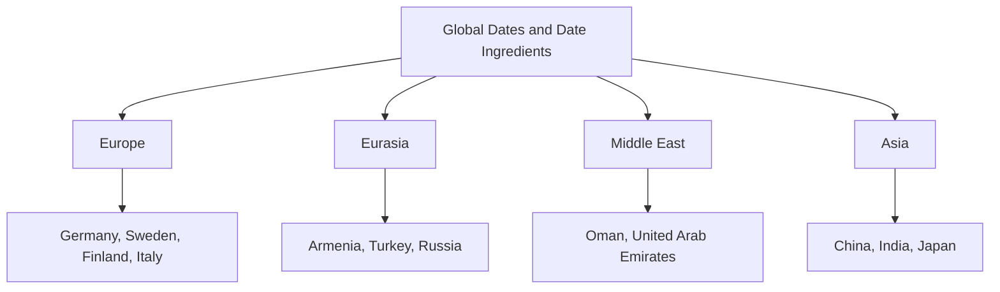
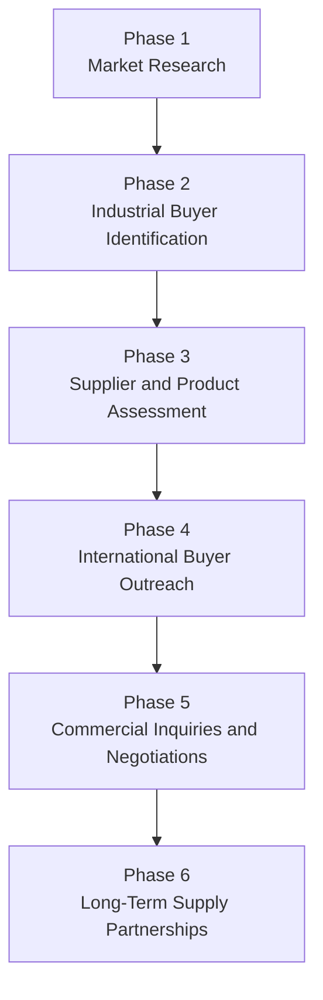

# Global Dates & Date Ingredients

## International B2B Sourcing & Industrial Market Opportunities

**Tangsir Daryanavard Co.**

International Business Development: **Mohammad Shafie Ashuri**

Tangsir Daryanavard Co. supports international sourcing and market development for dates and date ingredients. We connect potential suppliers with food manufacturers, importers, distributors, ingredient processors, and other qualified B2B buyers worldwide.

Our focus includes **Bulk Dates**, **Industrial Date Paste**, **Date Syrup for Food Manufacturing**, and **Date Sugar for the Food Industry**.

> This repository is an independent B2B information and market-development resource. It does not represent verified demand, confirmed buyers, guaranteed supply, certifications, commercial partnerships, or binding product offers.

## Contact Our Business Development Team

[](mailto:info@tangsirco.com?subject=Request%20for%20Quotation)

[](https://wa.me/989120821023?text=Hello%20Mr.%20Ashuri%2C%20we%20would%20like%20to%20discuss%20our%20date%20ingredient%20requirements.)

[](mailto:info@tangsirco.com?subject=Request%20for%20Product%20Specifications)

[](https://wa.me/989120821023)

## Company Profile

Tangsir Daryanavard Co. develops international B2B sourcing opportunities for dates and date products.

Our role is to support communication and commercial development between:

- Date and date-ingredient suppliers
- International food manufacturers
- Food ingredient processors
- Importers and distributors
- Industrial food buyers
- Wholesale and sourcing organizations

Our activities may include:

- Reviewing industrial buyer requirements
- Coordinating product and supplier inquiries
- Supporting requests for quotations
- Facilitating requests for product samples
- Coordinating available technical documentation
- Supporting international market research
- Developing long-term sourcing discussions

Every potential transaction remains subject to supplier qualification, buyer approval, technical verification, applicable regulations, and mutually agreed commercial terms.

## Products and Date Ingredients

| Product | Potential industrial applications | Documentation |
|---|---|---|
| Bulk Dates | Processing, bakery, confectionery, snacks, cereals and ingredient production | [View Bulk Dates](products/dates.md) |
| Industrial Date Paste | Bakery fillings, biscuits, energy bars, protein bars and healthy snacks | [View Date Paste](products/date-paste.md) |
| Date Syrup | Beverages, bakery products, confectionery, sauces and food formulations | [View Date Syrup](products/date-syrup.md) |
| Date Sugar | Bakery, cereals, granola, dry blends and snack formulations | [View Date Sugar](products/date-sugar.md) |

Product availability, specifications, packaging, samples, certifications, prices, minimum order quantities, and delivery conditions must be confirmed for each inquiry.

## Industrial Food Applications

Date ingredients may be evaluated by manufacturers in the following sectors:

- Chocolate manufacturing
- Confectionery manufacturing
- Bakery manufacturing
- Biscuit production
- Energy bar manufacturing
- Protein bar manufacturing
- Breakfast cereal manufacturing
- Granola manufacturing
- Beverage manufacturing
- Plant-based food manufacturing
- Healthy snack production
- Food ingredient processing

Detailed documentation:

- [Industrial Applications of Date Ingredients](industries/industrial-applications.md)
- [Food Manufacturing Segments](industries/food-manufacturing-segments.md)

## Ingredient-to-Industry Overview

| Buyer segment | Dates | Date Paste | Date Syrup | Date Sugar |
|---|:---:|:---:|:---:|:---:|
| Chocolate manufacturers | ✓ | ✓ | Potential | Potential |
| Confectionery manufacturers | ✓ | ✓ | ✓ | Potential |
| Bakery manufacturers | ✓ | ✓ | ✓ | ✓ |
| Biscuit producers | Potential | ✓ | ✓ | ✓ |
| Energy bar manufacturers | ✓ | ✓ | ✓ | ✓ |
| Protein bar manufacturers | ✓ | ✓ | ✓ | ✓ |
| Breakfast cereal manufacturers | ✓ | Potential | ✓ | ✓ |
| Granola manufacturers | ✓ | Potential | ✓ | ✓ |
| Beverage manufacturers | Potential | Potential | ✓ | Limited |
| Plant-based food manufacturers | ✓ | ✓ | ✓ | ✓ |
| Healthy snack producers | ✓ | ✓ | ✓ | ✓ |
| Food ingredient processors | ✓ | ✓ | ✓ | ✓ |

The table identifies possible areas for technical evaluation. It does not confirm suitability for any particular formulation or production process.

## Global Industrial Market Map

The initial international market-development program covers 12 countries:

| Region | Target markets |
|---|---|
| Northern and Central Europe | [Germany](markets/germany.md), [Sweden](markets/sweden.md), [Finland](markets/finland.md) |
| Southern Europe | [Italy](markets/italy.md) |
| Eurasia | [Armenia](markets/armenia.md), [Turkey](markets/turkey.md), [Russia](markets/russia.md) |
| Middle East | [Oman](markets/oman.md), [United Arab Emirates](markets/united-arab-emirates.md) |
| Asia | [China](markets/china.md), [India](markets/india.md), [Japan](markets/japan.md) |

For the complete market map, see:

- [Global Market Overview](markets/global-market-overview.md)
- [Markets Directory](markets/README.md)



## Market Information Status

Country documentation in this repository presents **potential market opportunities and research priorities**.

It does not claim:

- Verified product demand
- Confirmed purchasing activity
- Confirmed buyers or importers
- Existing supplier relationships
- Commercial partnerships
- Guaranteed market access
- Verified trade statistics

Country-specific findings must be validated through current market research, buyer qualification, regulatory review, and direct commercial communication.

## International B2B Development Process



The complete 12-month plan is available here:

[View the 12-Month International Business Development Roadmap](roadmap/international-business-development.md)

## International Buyer Inquiries

Potential customers may request:

- Bulk product quotations
- Technical product specifications
- Product samples
- Packaging information
- Available quality documentation
- International logistics discussions
- Long-term supply discussions
- International sourcing partnerships

[Submit an International Buyer Inquiry](contact/buyer-inquiries.md)

To support an efficient review, please provide:

- Company name and country
- Required product
- Intended industrial application
- Estimated order quantity
- Preferred packaging
- Destination country and port
- Required technical documentation
- Target purchasing or delivery period

## Buyer Verification and Confidentiality

Do not post confidential commercial information through public GitHub Issues, Discussions, pull requests, or comments.

Sensitive information—including prices, formulations, contracts, banking details, private company records, and confidential supply terms—should be communicated only through direct email or WhatsApp.

Buyers should independently verify:

- Supplier identity and capacity
- Product specifications
- Samples and production suitability
- Quality and food-safety documentation
- Certifications and regulatory compliance
- Packaging and labelling requirements
- Shipping and customs conditions
- Commercial and contractual terms

## Repository Structure

```text
global-dates-b2b-sourcing/
├── README.md
├── products/
│   ├── dates.md
│   ├── date-paste.md
│   ├── date-syrup.md
│   └── date-sugar.md
├── markets/
│   ├── README.md
│   ├── global-market-overview.md
│   ├── germany.md
│   ├── sweden.md
│   ├── finland.md
│   ├── china.md
│   ├── armenia.md
│   ├── turkey.md
│   ├── russia.md
│   ├── oman.md
│   ├── italy.md
│   ├── united-arab-emirates.md
│   ├── india.md
│   └── japan.md
├── industries/
│   ├── industrial-applications.md
│   └── food-manufacturing-segments.md
├── roadmap/
│   └── international-business-development.md
└── contact/
    └── buyer-inquiries.md
```

## Search Topics Covered

This repository provides B2B information relating to:

- Bulk Dates Supplier
- Industrial Date Paste
- Date Syrup for Food Manufacturing
- Date Sugar for Food Industry
- Date Ingredients for Energy Bars
- Date Paste for Bakery Manufacturers
- International Date Products Sourcing
- B2B Date Ingredients
- Dates for Industrial Food Processing

## Direct Contact

**Mohammad Shafie Ashuri**  
International Business Development  
**Tangsir Daryanavard Co.**

**WhatsApp:** [+98 912 082 1023](https://wa.me/989120821023)

**Email:** [info@tangsirco.com](mailto:info@tangsirco.com)

### Business Contact Actions

- [REQUEST A QUOTATION](mailto:info@tangsirco.com?subject=Request%20for%20Quotation)
- [DISCUSS YOUR INGREDIENT REQUIREMENTS](https://wa.me/989120821023?text=Hello%20Mr.%20Ashuri%2C%20we%20would%20like%20to%20discuss%20our%20date%20ingredient%20requirements.)
- [REQUEST PRODUCT SPECIFICATIONS](mailto:info@tangsirco.com?subject=Request%20for%20Product%20Specifications)
- [CONTACT US ON WHATSAPP](https://wa.me/989120821023)

---

© Tangsir Daryanavard Co. This repository operates independently within GitHub and does not require GitHub Pages, a separate domain, or external hosting.