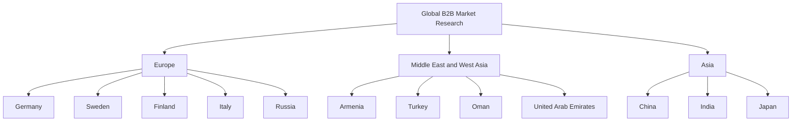

# Global Industrial Market Overview

[Home](../README.md) · [Country Market Index](README.md)

## Purpose

This document presents the initial international market-development framework of Tangsir Daryanavard Co. for dates and date-derived food ingredients.

The project covers:

- Bulk Dates
- Industrial Date Paste
- Date Syrup for Food Manufacturing
- Date Sugar for the Food Industry

The selected countries represent potential markets for structured research and international B2B development.

> **Important:** The opportunities presented in this document are research hypotheses. They do not represent verified demand, confirmed purchasing activity, trade statistics, existing customers, or commercial partnerships.

## Initial Global Markets

## Regional Market Structure

### Europe

- [Germany](germany.md)
- [Sweden](sweden.md)
- [Finland](finland.md)
- [Italy](italy.md)
- [Russia](russia.md)

### Middle East and West Asia

- [Armenia](armenia.md)
- [Turkey](turkey.md)
- [Oman](oman.md)
- [United Arab Emirates](united-arab-emirates.md)

### Asia

- [China](china.md)
- [India](india.md)
- [Japan](japan.md)

## Initial Market Opportunity Matrix

| Country | Potential food-industry focus | Relevant date ingredients | Research status |
|---|---|---|---|
| Germany | Bakery, confectionery, healthy snacks, bars, and ingredient processing | Date paste, date syrup, date sugar, dates | Potential opportunity; validation required |
| Sweden | Healthy snacks, bars, bakery, granola, and plant-based foods | Date paste, date syrup, date sugar | Potential opportunity; validation required |
| Finland | Breakfast cereals, bakery, granola, healthy snacks, and plant-based foods | Date paste, date syrup, date sugar | Potential opportunity; validation required |
| China | Bakery, beverages, confectionery, snacks, and ingredient processing | Dates, date paste, date syrup | Potential opportunity; validation required |
| Armenia | Bakery, confectionery, fruit processing, and food distribution | Dates, date paste, date syrup | Potential opportunity; validation required |
| Turkey | Bakery, biscuits, confectionery, bars, healthy snacks, and ingredient processing | Dates, date paste, date syrup, date sugar | Potential opportunity; validation required |
| Russia | Bakery, confectionery, cereal, snacks, and ingredient processing | Dates, date paste, date syrup | Exploratory opportunity; compliance review required |
| Oman | Date processing, bakery, confectionery, beverages, and foodservice | Dates, date paste, date syrup, date sugar | Potential opportunity; validation required |
| Italy | Bakery, biscuits, chocolate, confectionery, bars, and ingredients | Date paste, date syrup, dates | Potential opportunity; validation required |
| United Arab Emirates | Food processing, bakery, confectionery, beverages, distribution, and foodservice | Dates, date paste, date syrup, date sugar | Potential opportunity; validation required |
| India | Bakery, biscuits, confectionery, beverages, snacks, and ingredient processing | Dates, date paste, date syrup | Potential opportunity; validation required |
| Japan | Bakery, confectionery, functional snacks, beverages, and ingredient processing | Date paste, date syrup, date sugar, dates | Potential opportunity; validation required |

## Potential Industrial Applications

The following applications may be investigated in each target market:

- Bakery fillings
- Biscuit and cookie fillings
- Chocolate and confectionery centers
- Energy bar binding
- Protein bar binding
- Breakfast cereal clusters
- Granola binding and inclusions
- Healthy snack production
- Beverage formulations
- Fruit-based food formulations
- Plant-based food applications
- Industrial ingredient blends
- Further food processing

Technical suitability must be verified through current product documentation and buyer-led formulation trials.

## Potential Buyer Categories

Research may cover:

- Food manufacturers
- Chocolate manufacturers
- Confectionery manufacturers
- Bakery manufacturers
- Biscuit producers
- Energy bar manufacturers
- Protein bar manufacturers
- Breakfast cereal manufacturers
- Granola manufacturers
- Beverage manufacturers
- Plant-based food manufacturers
- Healthy snack producers
- Food ingredient processors
- Food ingredient importers
- Industrial ingredient distributors
- Contract manufacturers
- Private-label producers

A company identified through research must be described as a **potential prospect** unless actual purchasing activity is independently confirmed.

## Market Research Priorities

For every country, research should evaluate:

1. Current food-import regulations
2. Product registration requirements
3. Food-safety requirements
4. Ingredient and nutrition labeling rules
5. Customs and tariff requirements
6. Packaging and shelf-life expectations
7. Required technical documents
8. Relevant certification requirements
9. Industrial ingredient usage
10. Buyer categories and procurement channels
11. Importer and distribution structures
12. Logistics and storage conditions
13. Payment and banking feasibility
14. Applicable sanctions or trade restrictions
15. Local-language communication requirements

## Market Qualification Process

## Buyer Verification Standard

Every future company record should include:

- Legal or public company name
- Country
- Official website
- Relevant food-industry segment
- Potentially relevant date ingredient
- Public source supporting the classification
- Source URL
- Date of verification
- Public business contact channel
- Research status
- Next research action

Do not:

- Invent company names
- Invent buyer contact information
- Claim that a company purchases date ingredients without evidence
- Describe a potential prospect as a confirmed customer
- Publish confidential commercial information
- Invent certifications, specifications, partnerships, or supply agreements

## Business Development Opportunities

Potential international business-development activities include:

- Identifying application-specific manufacturers
- Identifying qualified ingredient importers
- Identifying industrial ingredient distributors
- Comparing date ingredient formats with manufacturing requirements
- Preparing technical-document packages
- Coordinating product sample requests
- Supporting buyer-led application trials
- Preparing quotations for verified requirements
- Discussing long-term supply opportunities
- Developing international sourcing partnerships

These activities remain subject to product availability, supplier confirmation, regulatory requirements, and commercial feasibility.

## Compliance Notice

Food regulations, customs requirements, labeling rules, sanctions, export controls, payment restrictions, and logistics conditions may change.

Current requirements must be reviewed using official sources and qualified professional advisers before commercial activity begins.

Special compliance and counterparty screening may be necessary for certain markets.

## International Buyer Inquiries

Professional buyers may request:

- Bulk Product Quotations
- Technical Product Specifications
- Product Samples
- Long-Term Supply Discussions
- International Sourcing Partnerships

### REQUEST A QUOTATION

[Send a quotation request](mailto:info@tangsirco.com?subject=Request%20a%20Quotation%20-%20Dates%20and%20Date%20Ingredients)

### DISCUSS YOUR INGREDIENT REQUIREMENTS

[Contact us on WhatsApp](https://wa.me/989120821023?text=Hello%20Tangsir%20Daryanavard%20Co.%2C%20I%20would%20like%20to%20discuss%20date%20ingredient%20requirements.)

### REQUEST PRODUCT SPECIFICATIONS

[Request technical product information](mailto:info@tangsirco.com?subject=Request%20Product%20Specifications%20-%20Date%20Ingredients)

## Contact

**Mohammad Shafie Ashuri**

**Tangsir Daryanavard Co.**

WhatsApp: [+98 912 082 1023](https://wa.me/989120821023)

Email: [info@tangsirco.com](mailto:info@tangsirco.com)

---

*This market overview identifies potential international opportunities for research. It does not claim verified market demand, confirmed buyers, or existing commercial relationships.*