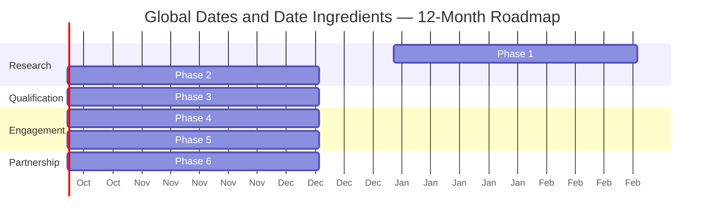
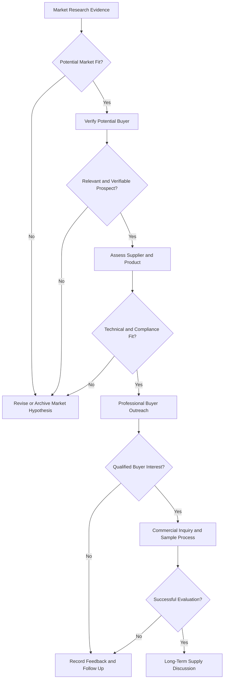

# 12-Month International B2B Market Development Roadmap

[Home](../README.md) · [Global Markets](../markets/global-market-overview.md) · [Industrial Applications](../industries/industrial-applications.md)

## Purpose

This roadmap presents a structured 12-month international market-development program for dates and date-derived food ingredients.

The roadmap covers:

- Bulk Dates
- Industrial Date Paste
- Date Syrup for Food Manufacturing
- Date Sugar for the Food Industry

It is designed to support professional market research, industrial buyer identification, supplier assessment, international outreach, commercial inquiries, and long-term sourcing relationships.

This roadmap is a proposed development framework. It is not a record of completed activities, confirmed buyers, guaranteed transactions, or existing partnerships.

## Six-Phase Roadmap

## 12-Month Timeline

The dates above illustrate a 12-month sequence and may be adjusted to the actual program start date.

## Roadmap Summary

| Phase | Timing | Main objective |
|---|---|---|
| Phase 1 | Months 1–2 | Market Research |
| Phase 2 | Months 3–4 | Industrial Buyer Identification |
| Phase 3 | Months 5–6 | Supplier and Product Assessment |
| Phase 4 | Months 7–8 | International Buyer Outreach |
| Phase 5 | Months 9–10 | Commercial Inquiries and Negotiations |
| Phase 6 | Months 11–12 | Long-Term Supply Partnerships |

# Phase 1: Market Research

## Timing

Months 1–2

## Objective

Develop an evidence-based understanding of potential international markets for dates and date ingredients.

## Activities

- Review the 12 initial target countries
- Study potential food-manufacturing segments
- Identify relevant date ingredient applications
- Review current import requirements
- Review food-safety and labeling requirements
- Review customs and tariff considerations
- Review logistics and storage conditions
- Review payment and banking feasibility
- Identify applicable sanctions or trade restrictions
- Review local-language communication needs
- Record reliable public sources
- Separate research hypotheses from verified facts

## Target Markets

- Germany
- Sweden
- Finland
- China
- Armenia
- Turkey
- Russia
- Oman
- Italy
- United Arab Emirates
- India
- Japan

## Deliverables

- Country research files
- Market research checklist
- Regulatory research priorities
- Industrial application matrix
- Preliminary market-ranking framework
- List of evidence gaps requiring further research

## Decision Gate

A market should proceed to buyer identification only when there is sufficient evidence of potential industrial relevance and no unresolved initial compliance barrier.

# Phase 2: Industrial Buyer Identification

## Timing

Months 3–4

## Objective

Identify real and relevant food manufacturers, processors, importers, and industrial ingredient distributors.

## Activities

- Identify real companies through official websites
- Classify companies by food-industry segment
- Record official company websites
- Identify publicly available business contact channels
- Research relevant product categories
- Search for public evidence of date ingredient use
- Distinguish manufacturers from brands, distributors, and retailers
- Classify each organization as a potential prospect
- Record source URLs and verification dates
- Avoid presenting prospects as confirmed buyers

## Buyer Categories

- Chocolate manufacturers
- Confectionery manufacturers
- Bakery manufacturers
- Biscuit producers
- Energy bar manufacturers
- Protein bar manufacturers
- Breakfast cereal manufacturers
- Granola manufacturers
- Beverage manufacturers
- Plant-based food manufacturers
- Healthy snack producers
- Food ingredient processors
- Food ingredient importers
- Industrial ingredient distributors

## Deliverables

- Verified prospect database
- Company classification
- Official source record
- Public contact-channel record
- Ingredient-relevance hypothesis
- Research status and next action for every prospect

## Decision Gate

A company should proceed to qualification only when its legal or public identity, official website, relevant industry segment, and public business contact channel have been verified.

# Phase 3: Supplier and Product Assessment

## Timing

Months 5–6

## Objective

Assess available suppliers and product options against potential buyer requirements.

## Activities

- Identify available product categories
- Request current product specifications
- Request ingredient statements
- Request certificates of analysis where available
- Review origin and processing information
- Review microbiological criteria
- Review contaminant and pesticide-residue documentation
- Review allergen statements
- Review shelf life and storage requirements
- Review available packaging formats
- Review traceability and batch documentation
- Review applicable certifications
- Assess supplier production capacity
- Assess minimum-order quantities
- Assess lead times
- Assess sample availability
- Compare product characteristics with target applications

## Products Covered

### Bulk Dates

Assess:

- Variety
- Origin
- Pitted or unpitted format
- Size or grade
- Moisture
- Packaging
- Shelf life
- Industrial processing suitability

### Industrial Date Paste

Assess:

- Ingredient statement
- Texture
- Consistency
- Moisture
- Water activity
- Particle characteristics
- Packaging
- Application suitability

### Date Syrup

Assess:

- Ingredient statement
- Brix or soluble solids
- Viscosity
- pH where applicable
- Color
- Flavor
- Filtration
- Packaging
- Application suitability

### Date Sugar

Assess:

- Ingredient statement
- Particle size
- Moisture
- Water activity
- Flow behavior
- Solubility or dispersibility
- Packaging
- Application limitations

## Deliverables

- Supplier assessment records
- Product document checklist
- Application-matching matrix
- Sample availability record
- Preliminary supply capability review
- Identified documentation gaps

## Decision Gate

A product should proceed to buyer presentation only when its current documents, availability, technical characteristics, and intended application have been sufficiently reviewed.

# Phase 4: International Buyer Outreach

## Timing

Months 7–8

## Objective

Begin professional, targeted, and compliant communication with qualified potential buyers.

## Activities

- Prioritize qualified prospects
- Prepare segment-specific messages
- Prepare country-specific messages
- Prepare application-specific product introductions
- Use publicly available business contact channels
- Present potential product relevance without unsupported claims
- Offer technical information
- Offer sample discussions where appropriate
- Record communication dates
- Record buyer responses
- Record requested specifications
- Respect privacy and communication preferences
- Avoid publishing confidential information through GitHub Issues

## Outreach Principles

- Keep messages concise and professional
- Explain the potential ingredient application
- Do not claim that the company is already a buyer
- Do not send unsupported certifications or specifications
- Do not promise availability or pricing before confirmation
- Request permission before sending detailed commercial documents
- Record all follow-up actions

## Deliverables

- Prioritized outreach list
- Outreach message templates
- Contact-attempt record
- Buyer-response record
- Technical information requests
- Sample discussion requests
- Follow-up schedule

## Decision Gate

A prospect should proceed to commercial inquiry only when it expresses genuine interest, provides relevant requirements, or requests further technical or commercial information.

# Phase 5: Commercial Inquiries and Negotiations

## Timing

Months 9–10

## Objective

Convert qualified buyer interest into structured technical and commercial discussions.

## Activities

- Confirm the required product
- Confirm the intended application
- Confirm technical specifications
- Confirm trial and commercial quantities
- Confirm packaging requirements
- Confirm destination country
- Confirm delivery schedule
- Confirm applicable certifications
- Confirm regulatory-document requirements
- Coordinate product samples
- Collect trial feedback
- Prepare quotations
- Review Incoterms
- Review payment terms
- Review logistics
- Review customs requirements
- Review compliance and counterparty risks
- Document negotiation points

## Commercial Inquiry Checklist

- Product
- Application
- Required specification
- Trial quantity
- Estimated commercial quantity
- Packaging format
- Destination
- Delivery schedule
- Documentation requirements
- Certification requirements
- Incoterms
- Payment terms
- Sample requirements
- Logistics requirements
- Compliance review

## Deliverables

- Qualified buyer inquiry
- Technical requirement summary
- Sample coordination record
- Written quotation
- Negotiation record
- Risk and compliance review
- Proposed supply terms

## Decision Gate

A potential transaction should proceed only after technical requirements, product availability, pricing, payment, logistics, regulatory requirements, and counterparty compliance have been reviewed and documented.

# Phase 6: Long-Term Supply Partnerships

## Timing

Months 11–12

## Objective

Develop reliable, transparent, and sustainable international supply relationships.

## Activities

- Review product-trial performance
- Review quality consistency
- Review delivery performance
- Review supplier responsiveness
- Review buyer feedback
- Review complaint and corrective-action processes
- Review forecast quantities
- Review repeat-order requirements
- Review documentation updates
- Review pricing and commercial terms
- Establish communication responsibilities
- Define periodic performance reviews
- Discuss long-term supply planning
- Identify opportunities for additional products or applications

## Partnership Evaluation Areas

- Product quality
- Specification consistency
- Traceability
- Documentation
- Production capacity
- Delivery reliability
- Communication quality
- Technical support
- Commercial transparency
- Compliance
- Forecasting
- Risk management

## Deliverables

- Performance review
- Repeat-order assessment
- Long-term supply proposal
- Quality and communication framework
- Forecast and capacity discussion
- Partnership-development plan

## Decision Gate

A long-term relationship should be considered only after successful technical evaluation, commercial performance, due diligence, and mutual written agreement.

## Development Decision Process

## Key Performance Indicators

Potential indicators for program management include:

| Area | Potential indicator |
|---|---|
| Market research | Number of country research files completed |
| Prospect identification | Number of prospects supported by official sources |
| Buyer qualification | Number of relevant, verified potential prospects |
| Product assessment | Number of complete supplier-document packages |
| Outreach | Number of targeted professional contacts |
| Engagement | Number of technical or commercial responses |
| Samples | Number of qualified sample discussions |
| Commercial inquiries | Number of documented quotation requests |
| Trials | Number of completed buyer-led product trials |
| Partnerships | Number of qualified repeat-supply discussions |

These indicators measure development activity. They do not represent guaranteed sales or partnerships.

## Working Principles

- Keep potential opportunities separate from verified facts
- Record source URLs and verification dates
- Never identify an organization as a buyer without confirmation
- Do not invent companies, contacts, specifications, or certifications
- Share confidential information only through private channels
- Confirm product availability before making commercial commitments
- Review legal, regulatory, banking, sanctions, and logistics requirements
- Maintain written records of technical and commercial decisions

## International Buyer Inquiries

Professional buyers may request:

- Bulk Product Quotations
- Technical Product Specifications
- Product Samples
- Long-Term Supply Discussions
- International Sourcing Partnerships

### REQUEST A QUOTATION

[Send a quotation request](mailto:info@tangsirco.com?subject=International%20B2B%20Quotation%20Request%20-%20Date%20Ingredients)

### DISCUSS YOUR INGREDIENT REQUIREMENTS

[Contact us on WhatsApp](https://wa.me/989120821023?text=Hello%20Tangsir%20Daryanavard%20Co.%2C%20I%20would%20like%20to%20discuss%20an%20international%20date%20ingredient%20requirement.)

### REQUEST PRODUCT SPECIFICATIONS

[Request technical product information](mailto:info@tangsirco.com?subject=Request%20for%20Date%20Ingredient%20Specifications)

## Contact

**Mohammad Shafie Ashuri**

**Tangsir Daryanavard Co.**

WhatsApp: [+98 912 082 1023](https://wa.me/989120821023)

Email: [info@tangsirco.com](mailto:info@tangsirco.com)

---

*This roadmap is a proposed international business-development framework. It does not represent confirmed sales, verified demand, guaranteed transactions, or existing commercial partnerships.*